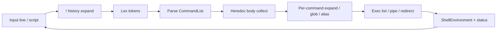

# Architecture

NEXUS follows a **Dragon Book** language-processor pipeline: acquire source text, tokenize, parse an AST-like command list, expand words, then execute against an owned shell environment.

## End-to-end flow

Interactive control structures (`foreach` / `while` / `if`) are handled **before** a normal one-line parse: the REPL collects a multi-line body, then runs that body through the same lex → parse → exec path repeatedly.

## Binary vs library

| Layer | Path | Role |
|-------|------|------|
| Binary | `src/bin/nexus.rs` | Argv → script or REPL; exit codes |
| Library | `src/lib.rs` | All shell semantics |
| REPL | `src/repl/` | Prompt, multiline, history prep, step loop |
| Exec | `src/exec/` | Run AST against env |
| Env | `src/env/` | Owned state (vars, locals, jobs, …) |

## Pipeline stages (detail)

### 1. Acquire line

- Interactive TTY (Unix): raw line editor (`src/repl/line_edit/tty/`)
- Non-TTY / non-Unix: plain read
- Prompt `$> ` only when stdin is a TTY
- Before each prompt: `precmd` special alias (if set)

### 2. History expansion

`history::expand_line` rewrites `!` designators into the line that will be lexed. Failures print to stderr and skip exec.

### 3. Lex

`lex::tokenize` / `tokenize_into` produce `Token`s: words (with quote/backtick tracking) and operators (`;` `|` `||` `&` `&&` redirects, parentheses).

### 4. Parse

`parse::parse_line` builds a `CommandList` of `Pipeline`s joined by `PipelineJoin` (`Seq` / `And` / `Or`), each with `|` stages and optional `background`.

### 5. Heredocs

After parse, `exec::collect_heredoc_bodies` (driven from the REPL) reads delimiter-terminated bodies for every `<<` redirect.

### 6. Expand → glob → alias

Per simple command (in exec):

1. Word expand (`$`, backticks, escapes) → `ExpandedWord`
2. Pathname glob (`*` `?` `[…]`); no match → literal
3. Alias rewrite of `argv[0]` (except `alias` / `unalias`; cycle-safe)

### 7. Execute

`exec::execute_list`:

- Honors `&&` / `||` short-circuit via `PipelineJoin`
- Foreground vs `&` background registration in `JobTable`
- Pipes (`src/exec/pipe/`), redirects, subshells, builtins vs externals
- Children inherit **only** the owned exported map (`env_clear` + shell vars)

## Key types

| Type | Module | Meaning |
|------|--------|---------|
| `Token` | `lex` | Lexeme + kind |
| `CommandList` | `parse` | `pipelines: Vec<Pipeline>` |
| `Pipeline` | `parse` | stages + `background` + `join` |
| `PipelineJoin` | `parse` | `Seq` \| `And` \| `Or` |
| `PipelineCommand` | `parse` | `Simple` \| `Subshell` |
| `Redirect` / `RedirectKind` | `parse` | `<` `>` `>>` `<<` |
| `ShellEnvironment` | `env` | Full session state |
| `CommandResult` | `exec` | `Status` \| `Exit` \| `Source` |
| `BuiltinResult` | `builtins` | + `Repeat { count, argv }` |
| `JobTable` | `jobs` | Background jobs |
| `KeyBindings` | `keybind` | Editor maps for `bindkey` |
| `History` | `history` | In-memory + file ops; TTY sessions auto load/save `~/.nexus_history` |

## Environment ownership

`ShellEnvironment` holds:

- **Exported** `vars` — inherited by children
- **Locals** — `$` expansion only; not exported
- **Aliases**, **history**, **key bindings**, **dir stack** — shell-only
- **Jobs** — live children; **cleared on `Clone`** so subshells do not inherit process handles

`cd` updates the process cwd and syncs specials / `cwdcmd`.

## Status and exit codes

| Situation | Typical code |
|-----------|----------------|
| Success | `0` |
| Builtin / command failure | non-zero from command |
| External not found | `127` + `{cmd}: Command not found.` |
| Program / I/O failure in binary | `84` |
| Stopped by SIGTSTP (Unix jobs) | `128 + SIGTSTP` |
| EOF | last status (subject to `ignoreeof`) |

Errors for the user go to **stderr**.
